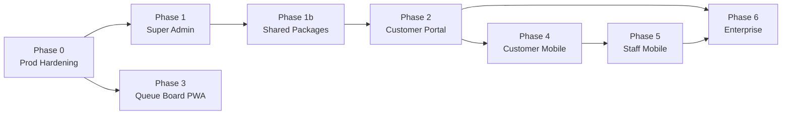

# BarberPro Full Execution Plan

## Phase Dependency Chain

Phase 3 can run in parallel with Phase 2. All other phases are strictly sequential.

---

## Phase 0 — Production Hardening

**Goal:** Make `apps/web` safe before any real paying tenant.

**Session 1 — Security fixes (2 files)**

- Fix `[apps/web/src/app/api/webhooks/stripe/route.ts](apps/web/src/app/api/webhooks/stripe/route.ts)`: swap `createClient()` → `createAdminClient()`. Add `processed_webhook_events` table and idempotency check.
- New migration: scope queue board anon RLS policies from `using (true)` → `using (branch_id in (select id from branches where is_active = true))` across `queue_tickets`, `queue_ticket_seats`, `branch_seats`, `branches`

**Session 2 — Performance: middleware caching**

- Rewrite `[apps/web/src/lib/supabase/middleware.ts](apps/web/src/lib/supabase/middleware.ts)`: after tenant lookup, set a short-lived signed cookie with `onboarding_completed` + `subscription_status`. Subsequent requests read from the cookie — zero DB queries on middleware.
- New migration: add all critical indexes (`app_users(auth_user_id)`, `app_users(tenant_id, is_active)`, `tenants(owner_auth_id)`, `tenants(slug)`, `queue_tickets(branch_id, status, created_at)`)
- Update all existing RLS inline subqueries → `get_my_tenant_id()` in a new migration

**Session 3 — Observability**

- Add Sentry to `apps/web` via `npx @sentry/wizard -i nextjs`
- Add `@vercel/analytics` and `@vercel/speed-insights` to root layout
- Choose Axiom or Logtail and add structured server-side logging helper

**Session 4 — Email (Resend)**

- Add `resend` package to `apps/web`
- Create `apps/web/src/lib/email/` with typed email send helpers
- Wire up: booking confirmation, payment failed alert to owner, staff invite email

**Session 5 — DevOps**

- Create `apps/web/.env.example` and `apps/web-admin/.env.example`
- Create `.github/workflows/ci.yml` — `typecheck → lint → build` on every PR
- Document Vercel project setup and domain config in `docs/DEPLOYMENT.md` (already written — verify against real Vercel settings)

---

## Phase 1 — Super-Admin App + Shared Packages

**Goal:** Working admin console + extract shared code so all future apps can reuse it.

**Session 1 — Extract `packages/db`**

- Create `packages/db/package.json`, `tsconfig.json`, `src/index.ts`
- Move `apps/web/src/lib/supabase/{client,server,admin,middleware,queries,branch-resolution}.ts` → `packages/db/src/`
- Update all imports in `apps/web` to `@barberpro/db`

**Session 2 — Extract `packages/auth`**

- Create `packages/auth/` with `getAuthContext`, role helpers
- Move `apps/web/src/actions/_helpers.ts` logic into the package
- Update imports in `apps/web`

**Session 3 — Wire up `apps/web-admin` auth**

- Add `@supabase/supabase-js`, `@supabase/ssr`, `@barberpro/db`, `@barberpro/auth` to `apps/web-admin`
- Create `apps/web-admin/src/middleware.ts` — check `is_super_admin()`, redirect to login if false
- Create `apps/web-admin/src/lib/env.ts` with required env vars
- Add Sentry to `apps/web-admin`

**Session 4 — Admin features (pages)**

- Tenant list page with search + plan/status filter (uses service role client)
- Tenant detail page — subscription status, Stripe link, branch count, user count, suspend/reactivate action
- User search page — find any `app_users` row across all tenants
- Platform metrics page — total tenants, active subscriptions, MRR calculation from `tenants` table

---

## Phase 2 — Customer Portal (`apps/customer`)

**Goal:** Launch `barberpro.my` — the customer-facing product.

**Session 1 — Scaffold**

- `pnpm create next-app apps/customer --typescript --tailwind --app`
- Wire up `@barberpro/db`, `@barberpro/auth`, shadcn/ui, Sentry, Vercel Analytics
- Add workspace scripts to root `package.json`
- Create Vercel project, assign `barberpro.my` domain

**Session 2 — Marketing / landing page**

- Home page (`/`) — hero, value prop, shop count, CTA to download app / find a shop
- `/how-it-works`, `/for-businesses` static pages

**Session 3 — Customer auth + DB**

- New migration: `customer_accounts` table (or add `role = 'customer'` to `app_users`) with `expo_push_token` column
- Signup / login pages using Supabase Auth (same project)
- Customer profile page

**Session 4 — Shop discovery + profiles**

- `/shops` listing page — all active tenants with name, city, service count
- `/shop/[slug]` profile page — photos, services, staff, hours, live queue badge (reuses `/api/queue-board`)

**Session 5 — Online booking flow**

- Service selection → barber selection (optional) → time slot picker → confirm
- Writes to `appointments` table with `source = 'online'`
- Sends booking confirmation email via Resend

**Session 6 — Live queue + loyalty**

- `/queue/[ticketId]` — live queue position screen using Supabase Realtime
- Loyalty points balance + history (reads from `customers.loyalty_points` + transactions)

---

## Phase 3 — Queue Board & Kiosk Polish

**Goal:** Production-quality in-shop display surfaces. Runs parallel to Phase 2.

**Session 1 — Queue Board PWA**

- Add Web App Manifest + service worker to `/queue-board` route in `apps/web`
- Implement Wake Lock API to prevent tablet screen sleep
- Fullscreen kiosk mode (hide browser chrome via `?kiosk=1` query param)
- Improve visual design: larger ticket numbers, seat labels, high-contrast

**Session 2 — Self Check-in Kiosk PWA**

- Fullscreen kiosk layout for `/check-in/[token]` — large touch targets, 3-step flow
- QR code generation page in dashboard (for printing shop entrance cards)
- Convert to PWA (manifest + service worker for offline last-known state)
- Confirmation screen redesign showing ticket number prominently

---

## Phase 4 — Customer Mobile App

**Goal:** iOS + Android app for end customers. Push notifications are the core feature.

**Session 1 — Scaffold**

- Rename `apps/mobile/` → `apps/mobile-customer/`, update `package.json` name
- Add: `expo-router`, `@supabase/supabase-js`, `nativewind`, `expo-notifications`, `expo-secure-store`, `@tanstack/react-query`
- Create `packages/ui-native/` and `packages/notifications/` shared packages
- Configure `eas.json` for development, preview, production builds
- Set up `app.json` with bundle identifiers and deep link scheme

**Session 2 — Auth + navigation skeleton**

- `(auth)/login.tsx`, `(auth)/signup.tsx` with Supabase Auth + SecureStore
- Tab navigator: Home, Discover, Bookings, Profile
- Role detection after login → customer tab layout

**Session 3 — Core screens**

- Home: upcoming booking card, nearby shops list
- Discover: shop list with city filter + map view
- Shop profile: services, barbers, hours, live queue badge

**Session 4 — Booking + queue**

- Book appointment flow (service → barber → time → confirm)
- `/queue/[ticketId]` live queue screen with Supabase Realtime
- QR code scanner for joining queue in-shop

**Session 5 — Push notifications**

- Register push token on first login, save to `customer_accounts.expo_push_token`
- Supabase Edge Function: monitor `queue_tickets` position changes → call Expo Push API
- Notification types: "You're #2 in queue", "It's your turn", booking reminders

**Session 6 — Loyalty + polish**

- Loyalty wallet screen (points balance, history)
- Booking history
- EAS Build production + App Store / Play Store submission

---

## Phase 5 — Staff Mobile App

**Goal:** Mobile companion for barbers. Lighter scope — web dashboard covers most needs.

**Session 1 — Scaffold + auth**

- Copy scaffold approach from `apps/mobile-customer`
- Create `apps/mobile-staff/` with same Expo stack
- Login → detect `role = barber|manager|cashier` → staff tab layout

**Session 2 — Core screens**

- Today's schedule (appointments assigned to me)
- Queue view for my branch (mark serving / done)
- Clock in / clock out attendance

**Session 3 — Commission + notifications**

- Commission dashboard — today, week, month breakdown by transaction
- Push notifications: new booking assigned, queue alerts

---

## Phase 6 — Enterprise & Scale Features

**Goal:** Unlock Professional/Enterprise tier value and handle growth.

**Session 1 — Payments**

- Stripe Payment Intent for online booking deposits
- E-wallet integration: GrabPay, Touch 'n Go via payment gateway

**Session 2 — Communications**

- SMS via Malaysian gateway (e.g. Nexmo/Vonage, StoreHub SMS)
- WhatsApp Business API notification option

**Session 3 — Multi-branch enterprise**

- Cross-branch staff scheduling
- Branch-level P&L reports
- Centralized product catalog shared across branches

**Session 4 — Background jobs**

- Move payroll calculation and report generation to Vercel Cron / Supabase Edge Functions
- Webhook idempotency and retry queue (Vercel Queues)

**Session 5 — Analytics**

- Customer retention cohorts
- LTV tracking
- Tenant usage metrics for super admin

---

## Ongoing (Every Phase)

- Run `supabase gen types typescript --local > apps/web/src/types/database.types.ts` after every migration
- Keep `docs/ROADMAP.md` checklist updated as items complete
- Security review: any new table gets RLS policies using `get_my_tenant_id()`
- Performance budget: Core Web Vitals stay green in Vercel Analytics

