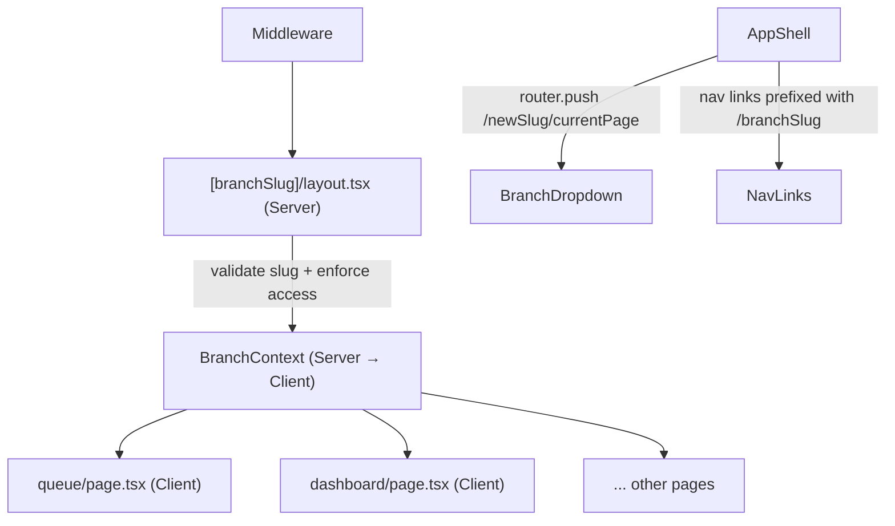

# Branch URL Routing Migration

## Goal

Move from client-side localStorage branch selection to URL-encoded branch context, so every page is shareable, bookmarkable, and server-renderable with the correct branch scope. Also fix secondary issues found along the way.

## New URL Structure

```
Before:  /queue              (branch from localStorage)
After:   /digital-linked/queue
         /sultan-barber/queue
         /all/dashboard       ← owners only, aggregate view
```

Pages that stay flat (no branch context needed):
- `/billing`, `/branches`, `/settings`, `/profile`

These are static segments and **always win over** the `[branchSlug]` dynamic segment in Next.js routing — no collision risk.

## Architecture After Migration



## Files Affected

### New files
- [`apps/web-shop/src/app/(dashboard)/[branchSlug]/layout.tsx`](apps/web-shop/src/app/(dashboard)/[branchSlug]/layout.tsx) — server component, validates slug, enforces staff access, provides branch context
- [`apps/web-shop/src/app/(dashboard)/[branchSlug]/dashboard/page.tsx`](apps/web-shop/src/app/(dashboard)/[branchSlug]/dashboard/page.tsx) — re-export of existing page content (and so on for each moved page)

### Moved pages (into `[branchSlug]/`)
All pages currently under `(dashboard)/` except `billing`, `branches`, `settings`, `profile`:
- `dashboard`, `queue`, `appointments`, `pos`
- `customers`, `services`
- `staff`, `staff/[id]`
- `payroll`, `commissions`, `inventory`, `expenses`, `promotions`, `reports`

### Modified files
- [`apps/web-shop/src/components/app-shell.tsx`](apps/web-shop/src/components/app-shell.tsx) — nav links prefixed, branch switcher uses `router.push`
- [`apps/web-shop/src/components/tenant-provider.tsx`](apps/web-shop/src/components/tenant-provider.tsx) — remove localStorage logic, read branch from URL prop
- [`apps/web-shop/src/lib/supabase/middleware.ts`](apps/web-shop/src/lib/supabase/middleware.ts) — redirect to `/{slug}/dashboard` after login, staff goes to their branch slug
- All server actions with `revalidatePath` calls — update paths or switch strategy (see Phase 4)

---

## Phase 1 — New `[branchSlug]/layout.tsx` (Server Component)

This is the core of the migration. The layout:

1. Reads `params.branchSlug`
2. Calls `getCurrentTenant()` (already called by parent `(dashboard)/layout.tsx`) — reuse via a shared cache
3. Validates the slug:
   - `"all"` → owner-only; no specific branch filter
   - Otherwise → query `branches` table for `slug = params.branchSlug AND tenant_id = tenantId`
4. Access enforcement for non-owners:
   ```typescript
   if (role !== "owner" && branch.id !== appUser.branch_id) {
     redirect(`/${appUser.branchSlug}/dashboard`);
   }
   ```
5. Provides `BranchContext` (existing `branch-context.tsx`) to children — this replaces the localStorage mechanism

The parent `(dashboard)/layout.tsx` stays unchanged (auth, subscription, trial checks).

## Phase 2 — Move Pages into `[branchSlug]/`

Physical move of page files. No logic changes to the page components themselves — they already consume branch via `useEffectiveBranchId()`, which will be updated to read from context instead of localStorage.

Update `useEffectiveBranchId` hook:
```typescript
// Before: reads activeBranchId from TenantProvider (localStorage)
// After: reads branchId from BranchContext (URL-resolved)
export function useEffectiveBranchId(): string | undefined {
  const { id } = useBranchContext(); // id is null when slug === "all"
  return id ?? undefined;
}
```

## Phase 3 — Update `AppShell` Navigation

Two changes in [`app-shell.tsx`](apps/web-shop/src/components/app-shell.tsx):

**Nav links** — prefix with branch slug:
```typescript
// Before: href: "/queue"
// After:  href: `/${activeBranchSlug}/queue`
// Special: if isAllBranches → href: `/all/queue`
```

**Branch switcher dropdown** — navigate instead of setState:
```typescript
// Before: setActiveBranch(b.id)  (localStorage write)
// After:  router.push(`/${b.slug}/${currentPage}`)
```

`currentPage` is extracted from `pathname` by stripping the existing slug prefix.

**Active state** — update `isNavActive`:
```typescript
// Before: pathname.startsWith(href)
// After:  pathname.startsWith(`/${activeBranchSlug}${href}`)
```

## Phase 4 — Fix Server Action `revalidatePath` Calls

Currently, actions like `createQueueTicket` call `revalidatePath("/queue")` — this will not match the new path `/digital-linked/queue`.

**Recommended fix** — switch to layout-level revalidation:
```typescript
revalidatePath("/(dashboard)/[branchSlug]/queue", "page")
// This revalidates all branches' queue pages — acceptable
```

Or pass `branchSlug` into the action via `FormData` and call:
```typescript
revalidatePath(`/${branchSlug}/queue`)
```

Affected actions: `queue.ts`, `seats.ts`, `appointments.ts`, `pos.ts`, `expenses.ts`, `inventory.ts`, `staff.ts`, `payroll.ts`, `commissions.ts`.

## Phase 5 — Update Middleware Redirect Logic

In [`lib/supabase/middleware.ts`](apps/web-shop/src/lib/supabase/middleware.ts):

**After successful login** — redirect to correct branch slug:
```typescript
// Before: url.pathname = "/dashboard"
// After:
const defaultSlug = tenantState.isStaff
  ? tenantState.branchSlug          // staff → their branch
  : tenantState.branches[0]?.slug   // owner → HQ or first branch
url.pathname = `/${defaultSlug}/dashboard`
```

**`isDashboardRoute` detection** — the current exclusion-list approach already works because new routes like `/digital-linked/queue` don't match any excluded prefix. No change needed here.

**Old flat routes** — add catch-all redirects for backward compatibility:
```typescript
// In middleware, if path is exactly /queue, /dashboard, etc.
// redirect to /{defaultSlug}/{page}
```

## Phase 6 — Update `TenantProvider`

Remove `localStorage` branch selection entirely. The branch is now determined by the URL and resolved server-side:

```typescript
// Before: useState + localStorage.getItem("bp_active_branch")
// After:  activeBranchId, activeBranchSlug come from BranchContext (server-resolved)
//         setActiveBranch is now a router.push (in AppShell, not provider)
```

`TenantProvider` still provides tenant-level context (tenantId, userRole, subscription, branches list). Branch-level context moves to `BranchContext`.

---

## Secondary Improvements (Included in Same Effort)

- **Redirect `returnTo` on login**: If unauthenticated user visits `/digital-linked/queue`, middleware stores path in `?returnTo=/digital-linked/queue` so they land back there after login
- **Staff login redirect**: Staff users are redirected to `/${branchSlug}/dashboard` where `branchSlug` is their assigned branch, not the first branch
- **`branches/[slug]/layout.tsx`**: Convert from `"use client"` + `useBranchBySlug` to a server component (consistent with new pattern, one fewer client-side fetch)
- **`isDashboardRoute` simplification**: Replace the long exclusion list with a route group prefix approach (optional, lower priority)
